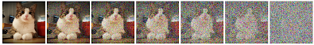
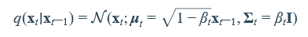
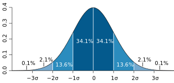
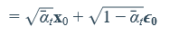

## Noise in Stable Diffusion, from a programmer's perspective

We've all seen images like this, where more noise is added to the image at each step:

but how would one actually implement this? Below are my findings.

## The noising equation

This cryptic notation

is not helpful, not to me anyway. (but if it is to you, go to https://theaisummer.com/diffusion-models/ instead)

---

If Stable diffusion was trained with 1000 noising steps, I would imagine, naively,  a loop like:

    image = get_image()
    for step in range(1000):
        noise = generate_noise()
        image = image + noise

However, they forget to mention that noise is not just added, it's mixed, so it's more like:

        image = image * image_mix + noise * noise_mix

In reality, these mixing weights are not constants, have different values at each step.
How to calculate them? Examining lms scheduler reveals this precalculation:

    num_train_timesteps: int = 1000
    beta_start: float = 0.00085
    beta_end: float = 0.012
    betas = torch.linspace(beta_start**0.5, beta_end**0.5, num_train_timesteps) ** 2

It turns out, the weights are calculated as:

        image_mix = (1-betas[step])**0.5
        noise_mix = betas[step]**0.5

which is what the equation was telling... 

## The noise

if you generate 100 random numbers, like:

    r = torch.rand(100)
    
the numbers you get will be between 0 and 1, and all values will be equally probable.

However, stable diffusion uses 'Gaussian noise', which you can generate by:

    r = torch.randn(100)

in this case, the numbers you get will be mostly between -3 and +3, and rarely out of this range. 
In fact, the probablities are known (68% between -1 and +1, etc.)

If you calculate the average and standard deviation of this gaussian noise:

    import torch
    r = torch.randn(100)
    print( torch.mean(r) )
    print( torch.std(r,unbiased=True) )

you get a mean of ~ 0, which means negative and positive values are equally probable,
and standard deviation of ~ 1, which means 68% is between -1 and +1.

Interestingly, if you multiply the noise by k, standard deviation also gets multiplied by k (68% will be between -k and +k), while the mean remains at 0.  In other words, the bell curve will just get wider, and remain symmetrical around 0.

One last thing to know is, standard deviation is equal to the square root of 'variance'. Therefore, if you want to get noise with a specific variance, you multiply the normal noise by the square root of it. The betas above were variance values, that's the reason for the square roots (**0.5) you see.

In conclusion, generate_noise() function is just torch.randn() 
or rather, to make it have the same data structure as the image: torch.randn_like(image)

## The trick

The loop above is valid if you want to generate 1000 noisy versions of an image. However, note that, in the loop,  each noisy version is generated using the previous noisy version (similar to calculating compound interest). It turns out, using a math trick, it is possible to get the noisy image at any step, without calculating all the previous noisy versions.

What this means is, to directly get the noisy image at any step, you can use:

    noisy_image_at_step = original_image * image_weight + noise * noise_weight

again, this is precalculated in lms scheduler:

    alphas = 1.0 - betas
    alphas_cumprod = torch.cumprod(alphas, dim=0)

then:

    image_weight = alphas_cumprod[step] ** 0.5
    noise_weight = (1 - alphas_cumprod[step]) ** 0.5

if you check the noise weight value for the last step, it's 0.9977. It seems the beta start and end values were carefully selected to make the last noisy version almost pure noise.

## The VAE

The last part is, implementing get_image() function. You probably know that Stable Diffusion denoising doesn't use actual image pixels, but an encoded/compressed version of it. And the final output is decoded/decompressed into an actual image you can view. The model that does this is called the VAE (variable auto encoder).

After you have the VAE model loaded, you can use its encode/decode methods to convert between your PIL Image and the encoded images (called latent images).  As an example, if your image size is 512x512 with 3 channels (RGB), the latent image will be 64x64 with 4 channels.

I'm not including here the actual code to load PIL image and vae encoding/decoding, it's available elsewhere. Suffice it to say that some scaling is also applied involving a magic number 0.18215, I'm guessing to bring the value range close to -3 to +3 which is compatible with the gaussian noise.

---

Thanks for reading. Please let me know if you spot incorrect information here.

---

update: after simplifying lms scheduler by decreasing order to 1, I have obtained a simple diffusion loop which probably is the same as euler method. see https://github.com/tkalayci71/mini-diffusion for working implementation.
See below for more explanations.

---

## Recap

As Stable Diffusion denoising is a delicate and chaotic process, we have to match the exact levels of noise used while the model was trained. Following precalculations are a given for 1000 steps:

    num_train_timesteps: int = 1000
    beta_start: float = 0.00085
    beta_end: float = 0.012
    betas = torch.linspace(beta_start**0.5, beta_end**0.5, num_train_timesteps) ** 2
    alphas = 1.0 - betas
    alphas_cumprod = torch.cumprod(alphas, dim=0)
    image_weights = alphas_cumprod **0.5
    noise_weights = (1-alphas_cumprod) **0.5

Now noisy image at any timestep can be obtained as:

    def get_noisy_image(original_image, original_noise, step):
        return original_image * image_weights[step] + original_noise  * noise_weights[step] 

Of course we don't yet know the original image, neither the original noise used while training. Just generate random noise instead, in vae latent format. If target image is 512x512, latents will be 64x64.

    original_image = torch.zeros(1,4,64,64)
    original_noise = torch.randn(1,4,64,64)
    noisy_image_at_step_999 = get_noisy_image(original_image, original_noise, 999)

## The Unet

Unet is the model that was trained to predict the noise. What it expects as input is:

* noisy image at any timestep
* the timestep value
* text embeddings. 

Text embeddings is the numerical representation of your prompt, consisting of 77x768 numbers. I'm ignoring it for now, since Unet works even if you pass all zeroes as text embeddings. (Of course in this case you get a random image, but still somewhat coherent)

What Unet outputs is the predicted original noise, without any scaling. With some scaling and subtracting the predicted noise, you can obtain a predicted original image.

However, if you just pass pure noise to unet and obtain the original image from that, you get a very blurry image. Therefore adding some of the noise back and reiterating becomes necessary.

## Timesteps

Rather than 1000 steps, it will be faster do it in a small number of steps: 

    steps = 10
    timesteps = torch.linspace(num_train_timesteps-1,0,steps,dtype=torch.int64)
    # timesteps= tensor([999, 888, 777, 666, 555, 444, 333, 222, 111,   0])

Extract image and noise weights for the selected timesteps, append 1.0 and 0.0 for convenience:

    image_weights = image_weights[timesteps]
    image_weights = torch.concat([image_weights,torch.tensor([1.0])])
    # image_weights= tensor([0.0683, 0.1265, 0.2120, 0.3242, 0.4563, 0.5967, 0.7314, 0.8480, 0.9383, 0.9996, 1.0000])
    noise_weights = noise_weights[timesteps]
    noise_weights = torch.concat([noise_weights,torch.tensor([0.0])])
    # noise_weights= tensor([0.9977, 0.9920, 0.9773, 0.9460, 0.8898, 0.8025, 0.6819, 0.5300, 0.3459, 0.0292, 0.0000])

Note that now the step value you pass to get noisy image function refers to our selected timestep index.

## Diffusion loop

Now a simplest diffusion loop would be:

    text_embeddings = torch.zeros(1,77,768)
    noisy_image = noisy_image_at_step_999
    for step in range(len(timesteps)):
        predicted_noise = call_unet(noisy_image, timesteps[step], text_embeddings)
        original_image = (noisy_image - predicted_noise * noise_weights[step]) / image_weights[step]
        noisy_image = get_noisy_image(original_image, predicted_noise, step+1)

## CFG Scale

To generate images related to a text prompt, you generate text embeddings by using the CLIP text encoder model and pass that to unet. Then unet will predict noise related to your prompt. However, not as strong as we would like.

They found a way to increase prompt strength, which is CFG scale. Simply, by processing two latents at the same time, one using an empty prompt, and one from your text prompt, then applying the following formula to boost the predicted noise:

    predicted_noise = noise_pred_empty + cfg_scale * (noise_pred_text - noise_pred_empty)

You can pass 2 image latents and 2 timesteps and 2 text embeddings to unet (which will process them in parallel as much as your hardware allows), and you get 2 predicted noise latents and use them in the formula above. Also, later, the empty prompt became the negative prompt, letting you manipulate the output image even further.

## Experiments

Some things I found:

Negative noise. This kind of switches dark/light parts of the result image:

    initial_noise = initial_noise * -1.0
    
Flipped noise. Not always results in flipped images.

    initial_noise = torch.flip(initial_noise,dims=[2])
  
Messing with some parameters. This makes result image more high contrast:

    beta_start: float = 0.00085 * 2

Quantized noise (with adjusted mean and std). This has surprisingly little effect:

    initial_noise = torch.randn(1,4,64,64)
    initial_noise = torch.ceil(initial_noise)
    initial_noise = initial_noise - torch.mean(initial_noise)
    initial_noise = initial_noise / torch.std(initial_noise,unbiased=True)    
    
Regular noise (with adjusted mean and std). SD seems to tolerate this. Results are not necessarily better but different.

    initial_noise = torch.rand(1,4,64,64)
    initial_noise = initial_noise - torch.mean(initial_noise)
    initial_noise = initial_noise / torch.std(initial_noise,unbiased=True)
    
## Thoughts

It is said that SD does not store training images, but stores distribution. It's unclear, do they mean histogram, or, mean and std, or something else? Either way, how do you recover data from distribution? If you store just mean and std of an image, almost infinite number of possible images would fit the bill . I can only speculate that if you store multiple distributions for different parts of the image, that would decrease number of  possible solutions. This seems plausible since Unet downsamples and upsamples the image multiple times. I'm starting to think this whole 'denoising' process may be similar to fourier transformation which I'm familiar with. If anyone really knows how this actually works, please let me know.
